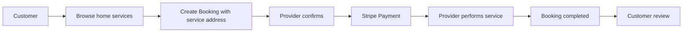
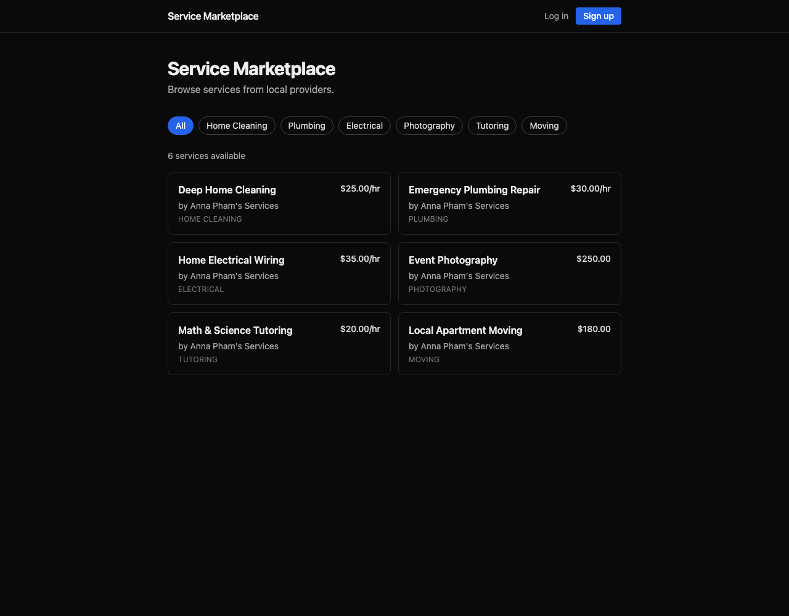

# HandyHub

[](https://github.com/FrorsttzNguyen/service-marketplace/actions/workflows/ci.yml)

HandyHub is a home and local services marketplace: customers book trusted pros for cleaning, repairs, moving, gardening, and other nearby services; providers manage their services and booking pipeline; the platform handles scheduling, secure Stripe payments, reviews, and commission tracking.

The repository is still named `service-marketplace`, and the Java package remains `com.hien.marketplace`. Product copy and provider-profile code now use **Provider** / **Pro** for the seller side, while the authentication role value remains `VENDOR` for compatibility.

## Why This Project Exists

This project is a learning vehicle for backend engineering fundamentals:

| Area | What this project demonstrates |
|------|--------------------------------|
| Java and Spring Boot | REST APIs, validation, transactions, dependency injection |
| OOP and domain design | Entities, value objects, state machines, domain methods |
| Database design | PostgreSQL schema design, indexes, constraints, Flyway migrations |
| System design | Modular monolith boundaries, ADRs, sequence/state thinking |
| Payments | Stripe PaymentIntent flow, webhook idempotency, refunds |
| Production practice | Docker, CI, typed frontend API client, environment-based config |

## Product Flow



Booking has one lifecycle:

```text
PENDING -> CONFIRMED -> PAID -> IN_PROGRESS -> COMPLETED
        \-> CANCELLED
PAID    \-> REFUNDED
```

## Architecture

HandyHub is a modular monolith, not a microservice system. The code is split by layers so business rules stay in the domain while HTTP, persistence, and external integrations stay at the edges.

```text
interfaces  ->  application  ->  domain  <-  infrastructure
 REST DTOs      use cases        models       JPA, Redis, Stripe
 controllers    transactions     rules        external clients
```

| Layer | Responsibility |
|-------|----------------|
| `interfaces` | REST controllers, request/response DTOs, validation errors |
| `application` | Use cases, transactions, authorization checks, mappers |
| `domain` | Business concepts: Booking, Payment, Money, TimeSlot, Address |
| `infrastructure` | Repositories, Redis cache, JWT security, Stripe integration |

## Tech Stack

| Layer | Technology |
|-------|------------|
| Backend | Java 21, Spring Boot 3, Spring Security, Spring Data JPA |
| Database | PostgreSQL with Flyway migrations |
| Cache and rate limits | Redis |
| Payments | Stripe Java SDK, Stripe.js, webhooks |
| API docs | Springdoc OpenAPI / Swagger |
| Frontend | Next.js 14 App Router, TypeScript, Tailwind CSS, TanStack Query |
| Testing | JUnit 5, Mockito, Spring Boot tests, Testcontainers where needed |
| Deployment | Docker, Render backend, Vercel frontend, GitHub Actions CI |

## Domain Model

| Concept | Meaning in HandyHub |
|---------|---------------------|
| `User` | Account with `CUSTOMER`, `VENDOR`, or `ADMIN` role. Product copy calls `VENDOR` a provider/pro. |
| `Provider` | Provider profile: business name, address, verification status, rating. |
| `Category` | Home-service category such as Home Cleaning, Plumbing, Deep Cleaning, Handyman. |
| `ServiceEntity` | A provider's bookable service with price, city, duration, status, and category. |
| `Booking` | Aggregate root for the customer request, schedule, service address, status, and money breakdown. |
| `Payment` | Child of Booking. Stores Stripe PaymentIntent data and payment state. |
| `Refund` | Child of Payment for refund tracking. |
| `Review` | Customer feedback after a completed booking. |
| `Money` | Value object storing cents instead of floating point values. |
| `TimeSlot` | Value object that validates start/end time and detects overlaps. |
| `Address` | Value object used for provider address and booking service address. |

### Booking, Payment, and Commission

Earlier versions separated `Booking` and `Order`. The current model intentionally has a single Booking aggregate:

```text
Service -> Booking -> Payment -> Refund
```

The Booking stores:

- `subtotal`: provider-facing service price.
- `commission`: platform fee calculated when the booking is created.
- `total`: amount charged to the customer through Stripe.
- `serviceAddress`: where the pro should perform the work.

Payment is attached directly to Booking, so checkout and webhook handling advance the same lifecycle instead of coordinating a second Order state machine.

### Double-Booking Prevention

Booking creation uses two layers:

1. Application layer: `BookingService` loads non-cancelled bookings for the same service/date and checks overlap with `TimeSlot.overlaps(...)`.
2. Database layer: `uq_booking_slot` keeps `(service_id, booking_date, start_time)` unique as a final backstop for same-start races.

Concurrent updates to an existing booking are protected by JPA optimistic locking through the `version` column.

## Project Structure

```text
service-marketplace/
├── docs/
│   ├── adr/                         # Architecture decision records
│   ├── api/openapi.yaml             # Backend contract used by the frontend type generator
│   ├── architecture/                # ERD and architecture notes
│   └── learning-roadmap.md
├── frontend/                        # Next.js App Router frontend
├── src/main/java/com/hien/marketplace/
│   ├── application/                 # Use cases, mappers, events
│   ├── domain/                      # Entities, value objects, business rules
│   ├── infrastructure/              # Persistence, security, Stripe, Redis
│   └── interfaces/                  # REST controllers and DTOs
├── src/main/resources/db/migration/ # Flyway SQL migrations
├── src/test/java/                   # Unit and integration tests
├── docker-compose.yml
└── render.yaml
```

## Getting Started

Prerequisites:

- Java 21
- Docker
- Node.js 18+
- Stripe test keys for checkout testing

Run the full local stack:

```bash
cp .env.example .env
docker compose up --build
```

Or run infrastructure in Docker and the backend from source:

```bash
docker compose up -d postgres redis
./mvnw spring-boot:run -Dspring-boot.run.profiles=dev
```

Run the frontend:

```bash
cd frontend
npm install
cp .env.example .env.local
npm run dev
```

Set `NEXT_PUBLIC_API_BASE_URL=http://localhost:8080` in `frontend/.env.local` for local backend development.

## Verification

Backend:

```bash
./mvnw test
```

Frontend:

```bash
cd frontend
npm run typecheck
npm run build
```

Regenerate the typed frontend API client after changing `docs/api/openapi.yaml`:

```bash
cd frontend
npm run gen:api
```

## Deployment

The backend is containerized with `Dockerfile` and deployed on Render using `render.yaml`. PostgreSQL and Redis are managed externally, so app redeploys do not reset data.

Required production environment variables include:

| Env var | Purpose |
|---------|---------|
| `SPRING_DATASOURCE_URL` | PostgreSQL JDBC URL |
| `SPRING_DATASOURCE_USERNAME` / `SPRING_DATASOURCE_PASSWORD` | Database credentials |
| `SPRING_DATA_REDIS_HOST` / `SPRING_DATA_REDIS_PORT` / `SPRING_DATA_REDIS_PASSWORD` | Redis connection |
| `STRIPE_API_KEY` / `STRIPE_WEBHOOK_SECRET` | Stripe backend secrets |
| `JWT_SECRET` | JWT signing secret |
| `APP_CORS_ALLOWED_ORIGINS` | Allowed frontend origins |

Live backend:

- [API](https://marketplace-api-kehz.onrender.com)
- [Health](https://marketplace-api-kehz.onrender.com/actuator/health)
- [Swagger UI](https://marketplace-api-kehz.onrender.com/swagger-ui/index.html)

Live frontend:

- [HandyHub web app](https://service-marketplace-alpha.vercel.app)



## Documentation

- [System design](docs/system-design.md)
- [Architecture decision records](docs/adr/)
- [OpenAPI spec](docs/api/openapi.yaml)
- [Database ERD](docs/architecture/erd/)
- [Learning roadmap](docs/learning-roadmap.md)
